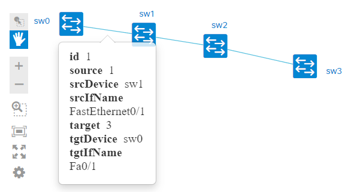

# macnetmap
Output network map from mac address table

Program show devices connectivity from output command "sh int", "sh mac-address-table" (for switches) or "sh ip arp" (for routers). Based only on mac-address information. For better result ping devices before run program. It update mac address tables.

Argument is folder with files.

Visualization is maked with [NeXt UI](https://developer.cisco.com/site/neXt/).

## For example
There is *output* folder with several files from such topology:

Result:

